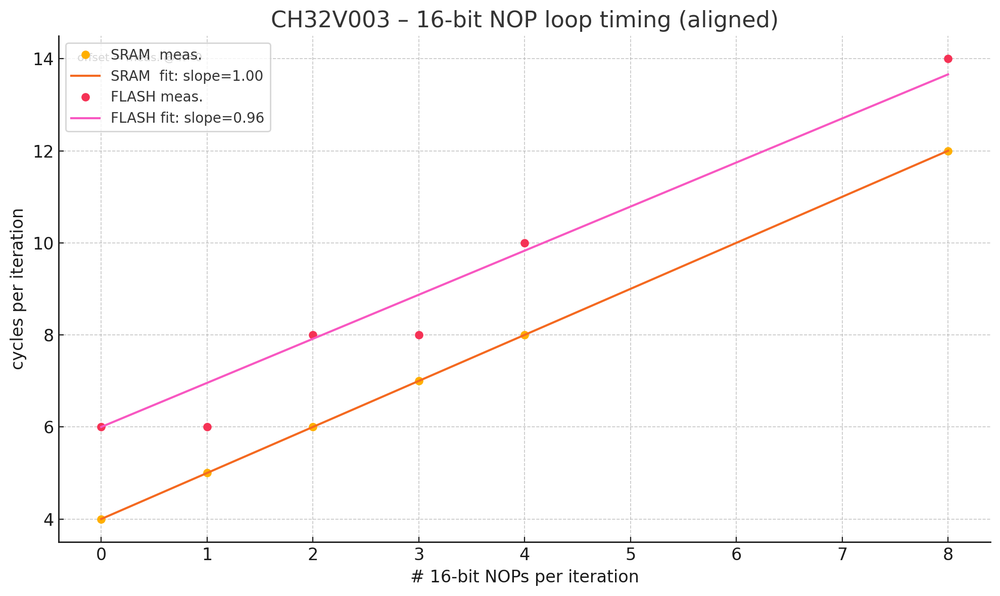
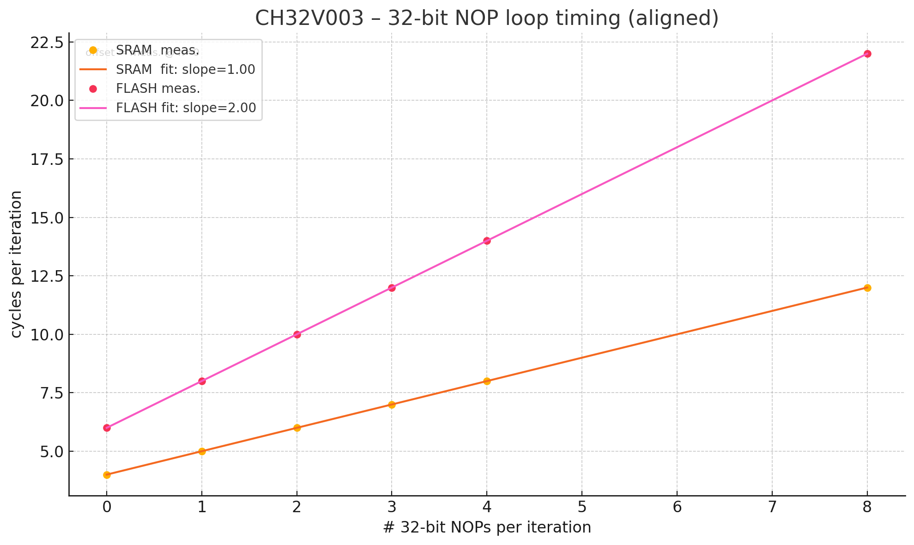
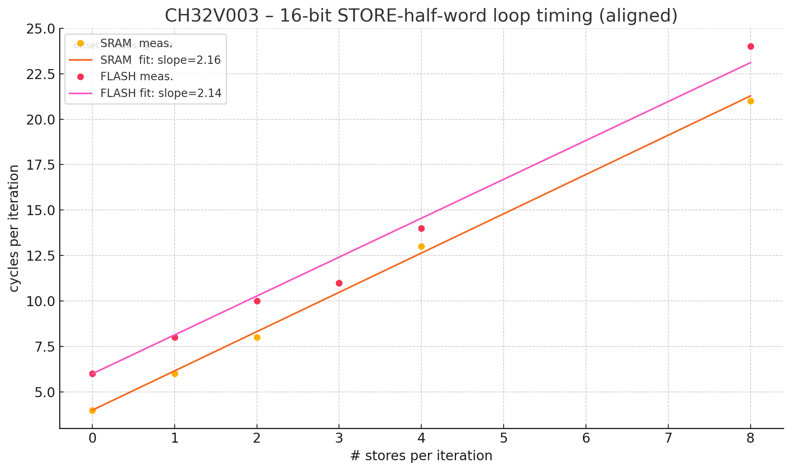

# CH32V003 Instruction Timing Test

This subproject investigates instruction timing on the CH32V003 microcontroller. It measures cycle counts for different instructions when executing from both Flash memory and SRAM.

## What is tested?

This program tests the execution time of RISC-V instructions on the CH32V003 microcontroller. The test instructions are embedded in a loop, and the number of cycles taken to execute them is measured. The results are printed to the console.

Test instructions are defined on top of main.c. Example:

```c
#define TEST_INSTR "add t0, t0, t1"           // Register-register addition  
```

The instruction is then embedded into a simple loop that runs 10000 times. The program measures the time taken to execute this loop in both Flash and SRAM memory.

The CH32V003 is clocked at 48MHz by default, which means that one wait state is needed for Flash memory access. The program tests timing both in Flash and in SRAM, using the `__attribute__((section(".srodata")))` attribute to place the test code in SRAM. 1. The program uses the CH32V003's SysTick counter to measure the number of cycles taken.

## Usage

1. Make sure you are in the `instruction_timing` directory
2. Compile and flash the project using the Makefile:
   ```bash
   make
   ```

3. Call 'make monitor' to see the output in the terminal:
   ```bash
   make monitor
   ```
# Results

## 16 Bit NOP

The plot below shows the instruction timing of the loop vs. number of inserted 16 bit NOP instructions. 

```assembly
20000006:	0001                	nop
20000008:	157d                	addi	a0,a0,-1
2000000a:	fd75                	bnez	a0,20000006 <run_test_sram+0x6>
```	

<p align="center">
   
</p>

First thing to note is that the bare loop without any additional instructions takes 4 cycles to execute in SRAM and 6 cycles in Flash. The CH32V003 uses a QinkeV2 RISC-V2A with a 2 step pipeline and static `branch prediction`. Although not explain further in the processes manual, experimentally this seems to imply that branches are assumed to be not-taken by default. For taken branches, the pipeline is flushed and two additional cycles are added to the execution time. 

Accessing the Flash memory takes 2 additional cycles. This is surprising, as I would have expected only one additional cycles due to the wait state. I am suspecting that it is not possible to abort the prefetch and all flash accesses are timed in steps of two cycles. 

This is also evident from the fact that the execution time of the loop is the same for 0 and 1 NOPs and 2/3 NOPs. 

Therefore the added penalty for fetching from a new flash address is either 1 or 2 cycles, depending on whether it has completed the last fetch or not.

We see that both for execution from SRAM and Flash, the execution time increases on average by 1 cycle per 16 bit NOP instructions. 

## 32 Bit NOP

The plot below shows the instruction timing of the loop vs. number of inserted 32 bit NOP instructions. The 32 bit NOP instruction is defined as `mv x0,x0`

```assembly
2000001c:	00000013   nop
20000020:	157d       addi	a0,a0,-1
20000022:	f97d       bnez	a0,20000018 <run_test_sram+0x18>
```

<p align="center">
   
</p>

For the 32 bit NOP instruction, we see that the execution time increases on average by 2 cycles per 32 bit NOP instructions for execution from Flash and 1 cycle for execution from SRAM. This is because even with prefetch, the Flash can only provide 32 bits of data every two cycles.

## 16 Bit Store

The plot below shows the instruction timing of the loop vs. number of inserted compressed store word instructions. The timing on the CH32V003 seems to be the same irregardless of whether the SRAM or the I/O region is accessed, since it does not have any provisions to speed up GPIO access.

```assembly
20000018:	c214    	sw	a3,0(a2)
2000001a:	157d    	addi	a0,a0,-1
2000001c:	fd75    	bnez	a0,20000018 <run_test_sram+0x18>
```

<p align="center">
   
</p>

In combination with memory accesses, things get a bit more complicated. Since the GPIO and SRAM are on the same bus, the added memory access cycle cannot be hidden, and every instruction takes two cycles. It also appears that there is no prefetch when executing from SRAM. (I would have expected that two C.SW instructions take 3 cycles in total, but they take 4)
